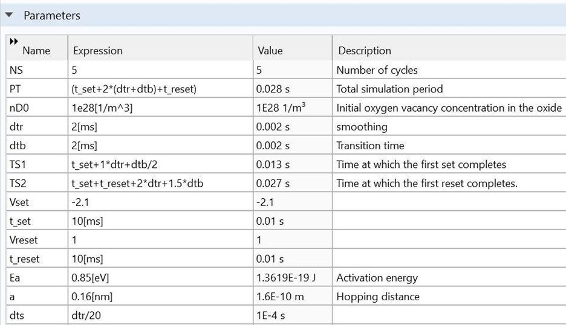
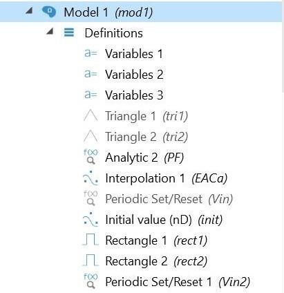
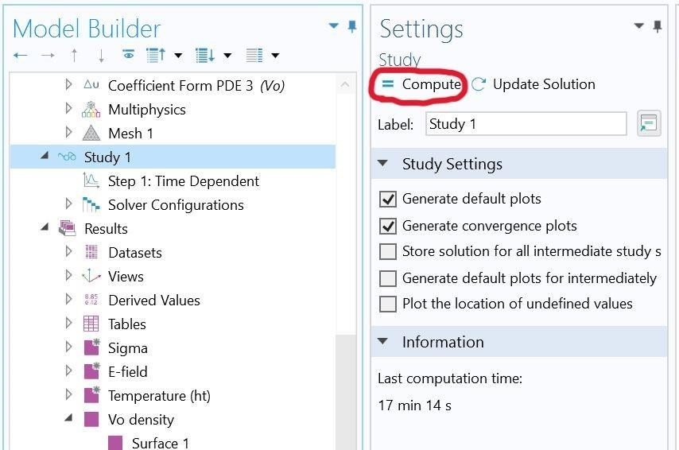
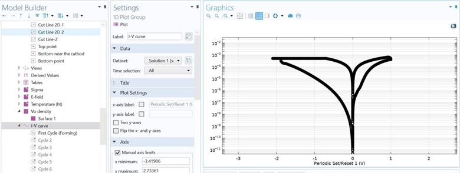
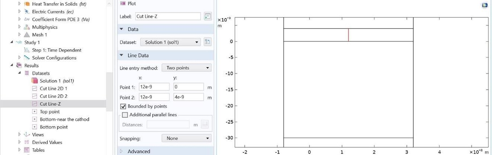
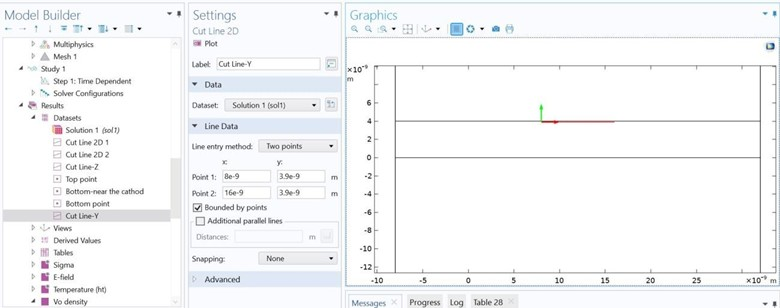

# Investigating the Effect of Electrical and Thermal Transport Properties on Oxide-Based Memristors Performance and Reliability 🔬⚡


### Created in COMSOL Multiphysics version 6.1

---

## 📝 Overview

**TaOx Memristor/Resistive Random-Access Memory Model**  
**Title**: *Investigating the Effect of Electrical and Thermal Transport Properties on Oxide-Based Memristors Performance and Reliability*  
**Authors**: Armin Gooran-Shoorakchaly, Sarah S. Sharif, Yaser M. Banad*  
School of Electrical and Computer Engineering, University of Oklahoma, Norman, Oklahoma, 73019, USA  
(Corresponding author’s e-mail: [bana@ou.edu](mailto:bana@ou.edu))

---

## 📜 Abstract

Achieving reliable resistive switching in oxide-based memristive devices requires precise control over conductive filament (CF) formation and behavior, yet the fundamental relationship between oxide material properties and switching uniformity remains incompletely understood. Here, we develop a comprehensive physical model to investigate how electrical and thermal conductivities influence CF dynamics in TaOx-based memristors. Our simulations reveal that higher electrical conductivity promotes oxygen vacancy generation and reduces forming voltage, while higher thermal conductivity enhances heat dissipation, leading to increased forming voltage. The uniformity of resistive switching is strongly dependent on the interplay between these transport properties.

We identify two distinct pathways for achieving optimal High Resistance State (HRS) uniformity with standard deviation-to-mean ratios (\(\sigma\)/\(\mu\)) as low as 0.045, each governed by different balances of electrical and thermal transport mechanisms. For the Low Resistance State (LRS), high uniformity (\(\sigma\)/\(\mu\) ≈ 0.009) can be maintained when either electrical or thermal conductivity is low. The resistance ratio between HRS and LRS shows a strong dependence on these conductivities, with higher ratios observed at lower conductivity values. These findings provide essential guidelines for material selection in RRAM devices, particularly for applications demanding high reliability and uniform switching characteristics.

---

##⚙️ Model Instructions

### Global Definitions

- **Parameters 1 and 2**  
  In the *Parameters* section, all parameters required for the model are defined. These parameters include physical constants, material properties, geometric dimensions, and any other variables used throughout the simulations. This setup ensures the model is fully customizable and allows reviewers to easily replicate the conditions under which the results were obtained.

### MODEL 1



In **Model 1 - Definitions**, as shown in the figure above, three sets of variables (`Variables 1`, `Variables 2`, and `Variables 3`) have been defined. Additionally, functions such as **Analytic 2 (PF)** and **Interpolation 1 (EACa)** have been created. The **Initial value (nD)** for the oxide region and **Periodic Set/Reset functions (Vin2)** for the applied pulse are also specified.

### Geometry 1
In the **Geometry** section, the structure of the model is carefully designed, including all relevant dimensions and spatial configurations.

### Materials
In the **Materials** section, the physical properties of all materials used in the model are defined. This includes parameters such as thermal conductivity, electrical conductivity, relative permittivity, and other relevant characteristics needed for accurate simulations.

### Physics
After defining the materials, the **Physics** setup includes:
- **Heat Transfer in Solids**  
- **Electric Currents**  
- **Coefficient Form PDE**

These physics interfaces accurately capture the thermal, electrical, and custom PDE behaviors required for the simulations.

### Study 1

Before starting the simulation, to avoid long computation times, set **NS (Number of Cycles) = 2** in **Global Definitions → Parameters**. Then click **Compute** in the **Study 1** section to begin the simulation.



---

## 🖥️ Results and Analysis

After defining all components, proceed to the **Results** section.

1. **I-V Characteristics**  
   - Navigate to **Results → I-V Curve** to view the plotted I-V curves for all cycles, showcasing the current-voltage relationship.

   

2. **Vo Density and Temperature**  
   - In **Results → Vo Density** and **Results → Temperature**, obtain 2D maps of the oxygen vacancy concentration and temperature across the Z-axis over time.
   - To observe T (temperature) and nd (oxygen vacancy concentration) along the Z direction, define a **cut line** across the Z-axis. This allows extracting data along that specific line to analyze how these parameters vary.

   

3. **Cut Line along Y-axis (Figure 5d Reference)**  
   - Based on Figure 5d of the article, it is necessary to draw a cut line along the y-axis. This cut line allows you to extract data along the y-direction for analysis. As shown in the figure, the cut line is defined across the y-axis, enabling observation of how oxygen vacancy concentration varies along this direction.

   
   

---

## ⚖️ Adjusting Parameters

In **Model 1 → Definition → Variable** (specifically `sigma0` and `kth`), you can fine-tune the slope of the graphs. Provided simulation files include two main folders:
1. **Figure 5_Electrical Conductivity (Sigma) Variation** – simulations with different \(\sigma_0\) values for a constant \(K_\text{th}\).
2. **Figure 6_Thermal Conductivity (Kth) Variation** – simulations with different \(K_\text{th}\) values for a constant \(\sigma_0\).

Use these folders to explore how changes in electrical or thermal conductivity impact the memristor’s performance and reliability.

---

## 🤝 Contributing

1. **Fork** the repository.
2. **Create** your feature branch: `git checkout -b feature/AmazingFeature`
3. **Commit** your changes: `git commit -m 'Add some AmazingFeature'`
4. **Push** to the branch: `git push origin feature/AmazingFeature`
5. **Open a Pull Request**.

---

## 🏷 License

This project is licensed under the [MIT License](LICENSE).

---

## 📌 How to Cite

> **Please cite this work as follows:**
> ```
> Gooran-Shoorakchaly, A., Sharif, S. S., & Banad, Y. M. (2025). Investigating the Effect of Electrical and Thermal Transport Properties on Oxide-Based Memristors Performance and Reliability.
> (COMSOL Multiphysics v6.1 Simulation Models).
> University of Oklahoma, Norman, OK, USA.
> Retrieved from: <GitHub Repository URL>
> ```

